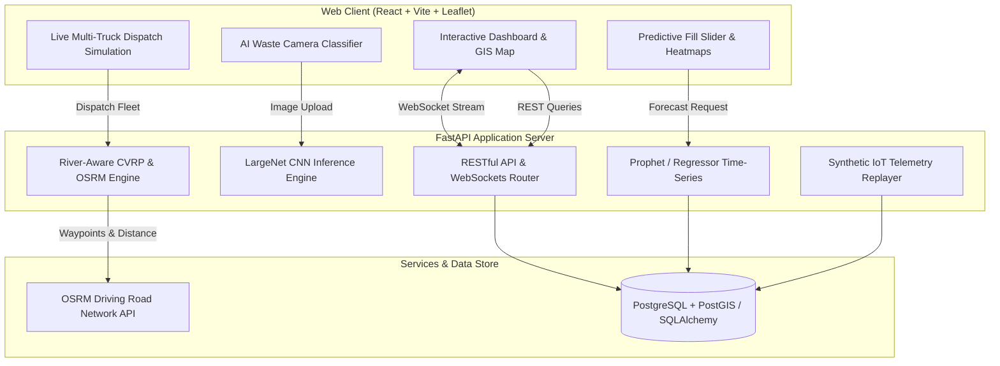

<div align="center">

# ◈ AMC WasteOptimizer AI
### Next-Gen Municipal Waste Intelligence & River-Aware Fleet Dispatch Platform
<p align="center">
  <b>Developed with precision by Team ResTart for BitNBuild 2026</b>
</p>

[](https://fastapi.tiangolo.com)
[](https://react.dev)
[](https://pytorch.org)
[](https://www.docker.com)
[](https://www.postgresql.org)
[](https://developers.google.com/optimization)

<p align="center">
  <b>Smart Municipal Waste Management System tailored for Ahmedabad Municipal Corporation (AMC)</b><br/>
  Featuring ML overflow prediction, on-device CNN waste classification, river-aware Capacitated Vehicle Routing (CVRP), A* road-snapped pathfinding, and live WebSocket telemetry replay.
</p>

---

</div>

<br/>

## ◈ Key Highlights & Core Innovations

<table>
  <tr>
    <td width="50%">
      <h3>◆ River-Aware Bridge Routing</h3>
      <p>
        Models the physical barrier of the <b>Sabarmati River</b> in Ahmedabad. Prevents naive "crow-flies" routes across water bodies by channeling cross-river traffic strictly across official bridges (<i>Subhash, Gandhi, Nehru, Ellis, Sardar, and Ambedkar bridges</i>) with real turn-by-turn road geometry from <b>OSRM</b>.
      </p>
    </td>
    <td width="50%">
      <h3>◆ On-Device CNN Classifier</h3>
      <p>
        Embedded <b>LargeNet PyTorch CNN</b> (1.1 MB) that runs instant edge image classification across 6 waste categories (<i>Plastic, Organic, Paper, Glass, Metal, Residual</i>) with zero cloud dependency or GPU requirement.
      </p>
    </td>
  </tr>
  <tr>
    <td width="50%">
      <h3>◆ Prophet Fill Forecasting</h3>
      <p>
        Time-series fill-level forecasting using <b>Meta Prophet</b> and linear autoregression trained on historical sawtooth sensor telemetry. Dynamically predicts overflow windows (<code>T+1h</code> to <code>T+72h</code>) with predictive risk heatmaps.
      </p>
    </td>
    <td width="50%">
      <h3>◆ Multi-Vehicle Simultaneous Dispatch</h3>
      <p>
        Solves <b>Capacitated Vehicle Routing (CVRP)</b> with <b>Google OR-Tools</b> and <b>A* pathfinding</b>. Dispatches 4 municipal trucks simultaneously from 4 regional AMC depots (<i>West, South, North-West, East</i>) with live telemetry and progress tracking.
      </p>
    </td>
  </tr>
</table>

<br/>

---

## ◈ System Architecture



<br/>

---

## ◈ Quick Start

### Run with Docker Compose (Recommended)

One single command launches the entire containerized stack:

```bash
docker-compose up --build
```

| Service | Address | Description |
| :--- | :--- | :--- |
| **Frontend Web App** | [http://localhost:5173](http://localhost:5173) | Interactive React + Leaflet control center |
| **Backend API** | [http://localhost:8000](http://localhost:8000) | FastAPI REST endpoints & WebSocket gateway |
| **Interactive Docs** | [http://localhost:8000/docs](http://localhost:8000/docs) | Swagger UI interactive API explorer |
| **Database** | `localhost:5432` | PostgreSQL with PostGIS extension |

> **Note**: On first boot, the system automatically bootstraps **40 authentic Ahmedabad municipal bins** mapped to real ground-truth landmarks, generates 60 days of hourly sensor readings, and initializes 4 AMC collection vehicles.

<br/>

---

## ◈ Ground-Truth AMC Municipal Deployment

The system is calibrated with **40 authentic landmark bin locations** across 5 administrative zones of Ahmedabad:

```
▶ West Zone (Navrangpura)
   ├── Law Garden Market · C.G. Road Panchvati · C.G. Road Swastik Cross
   └── Gujarat University · Navrangpura Commerce · Mithakhali · Sardar Patel Stadium

▶ North-West Zone (Bodakdev / Vastrapur)
   ├── Science City Main Plaza · Science City Road · Bodakdev Judges Bungalow
   └── Sindhu Bhavan Taj Skyline · Alpha One Mall · Vastrapur Lake · IIM Ahmedabad

▶ South-West Zone (Satellite / Sarkhej)
   ├── Prahlad Nagar Garden · Prahlad Nagar Corporate Rd · Satellite Shivranjani
   └── Jodhpur Gam · Shyamal Cross · Sarkhej Roza Monument · Vejalpur APMC

▶ Central Zone (Old City / Riverfront)
   ├── Sabarmati Riverfront (Vallabh Sadan) · Riverfront Event Centre · Ellis Bridge
   └── Nehru Bridge Plaza · Sidi Saiyyed Mosque · Bhadra Fort · Manek Chowk · Kalupur

▶ East Zone (Bapunagar / Nikol / Kankaria)
   ├── Kankaria Lake Gate 1 · Kankaria Lake Balvatika · Maninagar Railway Station
   └── Gita Mandir Bus Port · Bapunagar Diamond Market · Nikol Lake Garden
```

<br/>

---

## ◈ API Reference Matrix

<details open>
<summary><b>[+] Click to expand Core REST & WebSocket Endpoints</b></summary>
<br/>

| Method | Endpoint | Description |
| :---: | :--- | :--- |
| `GET` | `/bins` | Retrieve all bins with real-time fill %, battery, and location |
| `POST` | `/bins` | Register a new smart IoT bin |
| `GET` | `/bins/{id}/readings` | Historical telemetry readings (60-day sawtooth logs) |
| `POST` | `/classify` | Upload an image for instant on-device LargeNet classification |
| `GET` | `/predict/{bin_id}` | Prophet ML overflow prediction for an individual bin |
| `GET` | `/predict/bulk/all` | City-wide predicted fill distribution at `T+hours` |
| `GET` | `/priorities` | Multi-factor weighted urgency ranking of bins |
| `GET` | `/routes/today` | River-aware CVRP routes with OSRM street geometries |
| `GET` | `/routes/predictive` | Proactive dispatch routes for anticipated overflow |
| `GET` | `/alerts` | Active municipal alerts (overflow, tilt, thermal risk) |
| `POST` | `/simulation/step` | Advance IoT sensor telemetry simulation by one step |
| `POST` | `/simulation/inject-anomaly`| Inject live hardware anomalies (tilt tip-over, thermal fire, surge) |
| `POST` | `/simulation/reset` | Restore all 40 bins to safe nominal green state (<38%) |
| `WS` | `/ws` | Real-time live bi-directional telemetry broadcast socket |

</details>

<br/>

---

## ◈ Automated Testing

Execute unit and integration tests covering priority ranking, river barrier calculations, bridge routing, and geometry generation:

```bash
# From workspace root
cd backend
python -m pytest tests/ -v
```

```
============================= test session starts =============================
backend/tests/test_prioritizer.py::test_higher_fill_gets_higher_priority       PASSED
backend/tests/test_prioritizer.py::test_high_overflow_urgency                  PASSED
backend/tests/test_prioritizer.py::test_waste_type_weights                     PASSED
backend/tests/test_prioritizer.py::test_empty_bins_list                         PASSED
backend/tests/test_route_optimizer.py::test_haversine_distance                 PASSED
backend/tests/test_route_optimizer.py::test_haversine_same_point               PASSED
backend/tests/test_route_optimizer.py::test_build_distance_matrix              PASSED
backend/tests/test_route_optimizer.py::test_fallback_round_robin               PASSED
backend/tests/test_route_optimizer.py::test_optimize_routes_no_bins            PASSED
backend/tests/test_route_optimizer.py::test_river_aware_distance_penalizes_river_crossing PASSED
backend/tests/test_route_optimizer.py::test_route_geometry_includes_coordinates PASSED
backend/tests/test_route_optimizer.py::test_cluster_bins_separates_river_banks PASSED
============================== 12 passed in 3.09s ==============================
```

<br/>

---

## ◈ Tech Stack & Dependencies

```
Frontend:
  • React 18        — Modern component architecture with hooks & memoization
  • Vite            — Ultra-fast HMR bundler
  • Leaflet.js      — Dynamic interactive GIS mapping with custom overlays
  • Recharts        — Real-time statistical analytics & fill breakdown
  • Lucide Icons    — Clean, modern vector UI iconography

Backend:
  • FastAPI         — High-performance ASGI web framework with OpenAPI docs
  • Python 3.11     — Modern Python runtime
  • SQLAlchemy      — ORM with transaction safety & bulk operations
  • PostgreSQL      — Relational database with PostGIS geospatial indexing

Machine Learning & Optimization:
  • PyTorch         — LargeNet CNN for edge waste classification
  • Prophet         — Time-series forecasting for predictive collection
  • Google OR-Tools — Capacitated Vehicle Routing Problem (CVRP) solver
  • OSRM Engine     — Open Source Routing Machine road geometries
  • scikit-learn    — IsolationForest spatial anomaly detection
```

<br/>

---

<div align="center">

Crafted with excellence by **Team ResTart** for **BitNBuild 2026** — Transforming Smart Municipal Governance.

</div>
