<div align="center">

# ◈ AMC WasteOptimizer AI
### Next-Gen Municipal Waste Intelligence & Intelligent Fleet Dispatch Platform
<p align="center">
  <b>Developed with precision by Team ResTart for BitNBuild 2026</b>
</p>

[](https://fastapi.tiangolo.com)
[](https://react.dev)
[](https://pytorch.org)
[](https://www.docker.com)
[](https://www.postgresql.org)
[](https://developers.google.com/optimization)

<p align="center">
  <b>Smart Municipal Waste Management System tailored for Ahmedabad Municipal Corporation (AMC)</b><br/>
  Featuring ML overflow prediction, on-device CNN waste classification, Capacitated Vehicle Routing (CVRP), A* road-snapped pathfinding, macro spatial analytics, and live WebSocket telemetry replay.
</p>

---

</div>

<br/>

## ◈ Key Highlights & Core Innovations

<table>
  <tr>
    <td width="50%">
      <h3>◆ Turn-by-Turn Bridge Routing</h3>
      <p>
        Channels municipal collection traffic strictly across official Ahmedabad bridges (<i>Subhash, Gandhi, Nehru, Ellis, Sardar, and Ambedkar bridges</i>) with real turn-by-turn road geometry from <b>OSRM</b>, preventing naive direct paths.
      </p>
    </td>
    <td width="50%">
      <h3>◆ On-Device CNN Classifier</h3>
      <p>
        Embedded <b>LargeNet PyTorch CNN</b> (1.1 MB) that runs instant edge image classification across 6 waste categories (<i>Plastic, Organic, Paper, Glass, Metal, Residual</i>) with zero cloud dependency or GPU requirement.
      </p>
    </td>
  </tr>
  <tr>
    <td width="50%">
      <h3>◆ Prophet Fill Forecasting</h3>
      <p>
        Time-series fill-level forecasting using <b>Meta Prophet</b> and linear autoregression trained on historical sawtooth sensor telemetry. Dynamically predicts overflow windows (<code>T+1h</code> to <code>T+72h</code>) with predictive risk heatmaps.
      </p>
    </td>
    <td width="50%">
      <h3>◆ Multi-Vehicle Simultaneous Dispatch</h3>
      <p>
        Solves <b>Capacitated Vehicle Routing (CVRP)</b> with <b>Google OR-Tools</b> and <b>A* pathfinding</b>. Dispatches 4 municipal trucks simultaneously from 4 regional AMC depots (<i>West, South, North-West, East</i>) with live telemetry and progress tracking.
      </p>
    </td>
  </tr>
  <tr>
    <td width="50%">
      <h3>◆ Municipal Peak Hotspot Engine</h3>
      <p>
        Configures dedicated <b>Mega Dumpster telemetry (2,400L)</b> for Ahmedabad's <b>#1 waste producer</b>, tracking peak daily generation velocity (~48.5%/day), dynamic top ranking on hotspot leaderboards, and real-time high-priority compactor dispatch alerts.
      </p>
    </td>
    <td width="50%">
      <h3>◆ Real-Time Simulation & Stress Testing</h3>
      <p>
        Front-and-center IoT telemetry engine on the primary dashboard supporting automated playback, <b>+1h manual ticks</b>, nominal baseline resets, and live anomaly injection (night market crowd surge, structural vandalism tilt, and thermal fire hazards).
      </p>
    </td>
  </tr>
</table>

<br/>

---

## ◈ System Architecture

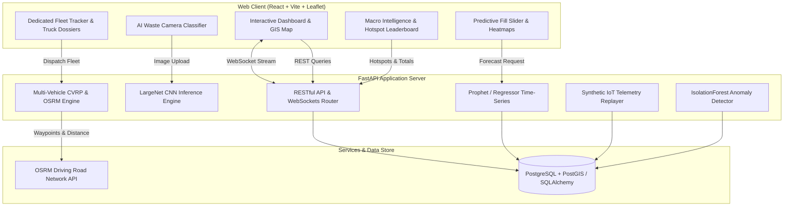

<br/>

---

## ◈ Platform Showcase & Visual Walkthrough

<div align="center">

| Operational GIS Map (Area Color Sectors) | Glassmorphic Telemetry & Alert Banner |
| :---: | :---: |
| 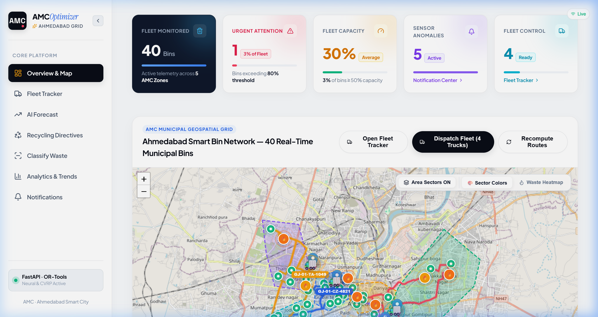 | 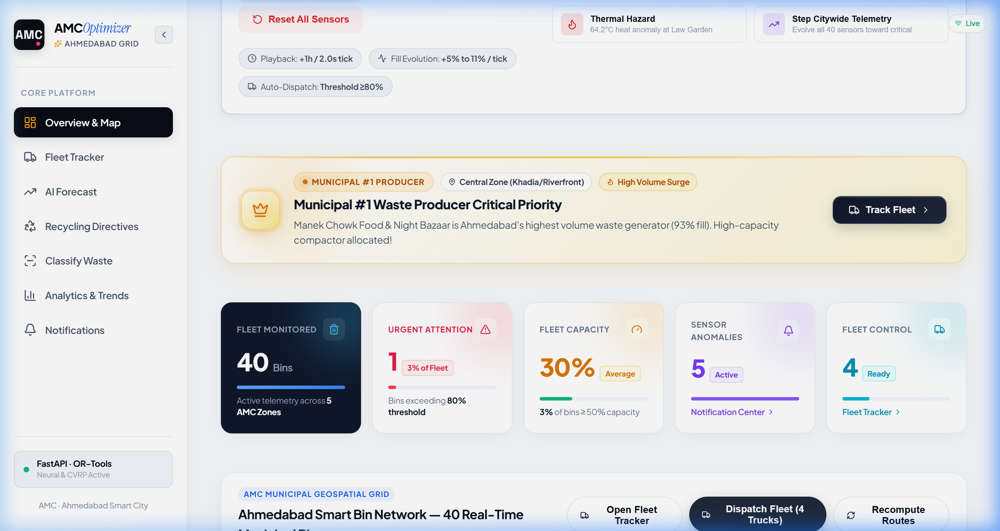 |
| *Color-coded administrative sectors, clean non-cluttered bin pins, bridge route optimization* | *Real-time IoT streaming banner, active vehicle KPIs, manual +1h ticks & stress tests* |

| Municipal Fleet Telematics Tracker | Macro Intelligence & Hotspot Leaderboard |
| :---: | :---: |
| 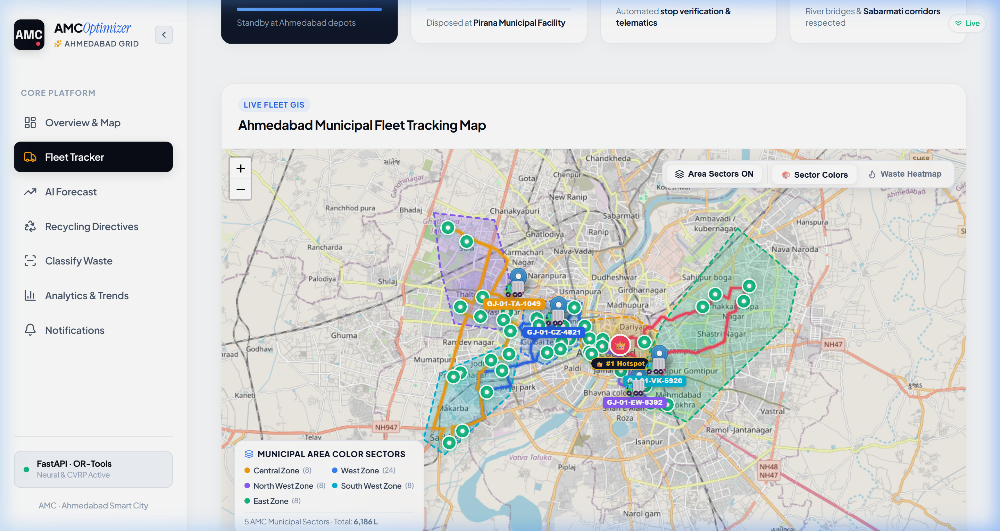 | 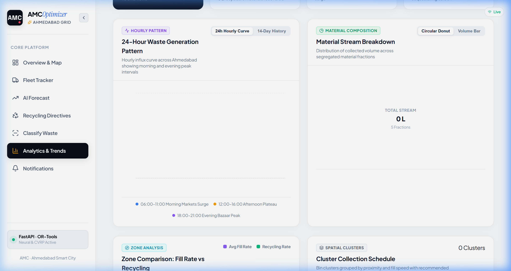 |
| *Simultaneous 4-depot truck dispatch, live telemetry, and expandable driver dossiers* | *Volumetric waste totals, daily velocity rankings, and automated municipal directives* |

| Predictive AI Overflow Forecasting (Prophet) | On-Device LargeNet CNN Image Classifier |
| :---: | :---: |
| 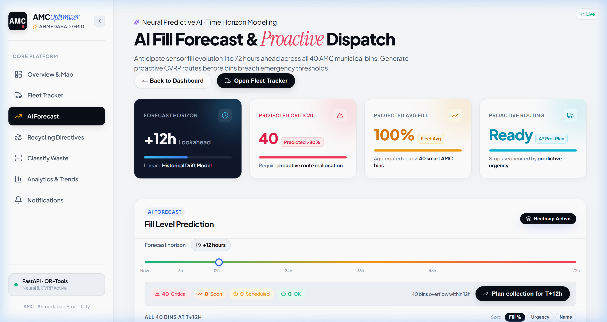 | 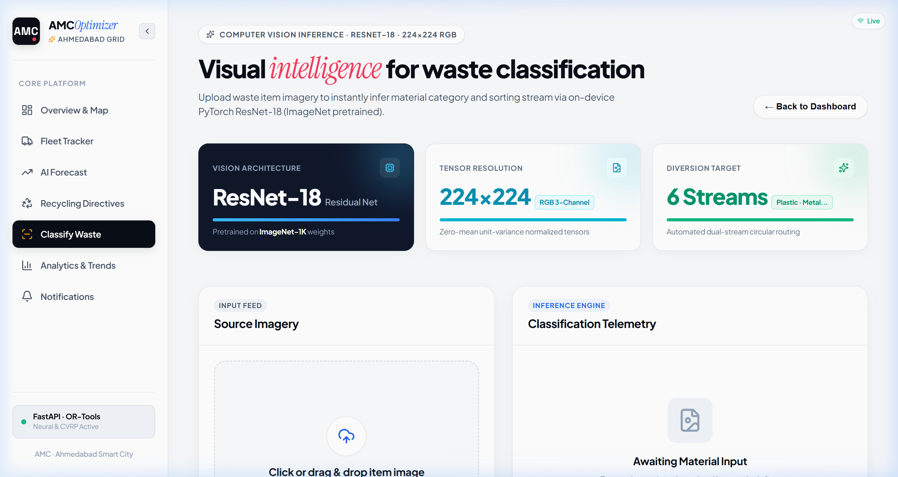 |
| *Time-series regression forecasting dynamic overflow windows up to T+72h* | *Embedded 1.1 MB PyTorch CNN for real-time edge 6-class waste classification* |

| Circular AI Material Diversion Directives | Technical Recycling Methods & MRF Protocols |
| :---: | :---: |
| 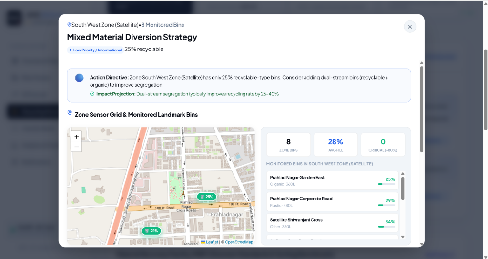 | 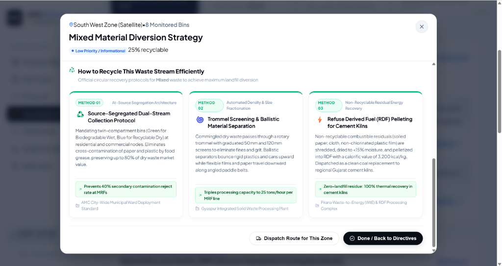 |
| *Interactive zone sensor grid, monitored landmark telemetry, and diversion strategies* | *3 official circular recovery engineering methods per waste stream with quantified impacts* |

</div>

<br/>

---

## ◈ Quick Start

### Run with Docker Compose (Recommended)

One single command launches the entire containerized stack:

```bash
docker-compose up --build
```

| Service | Address | Description |
| :--- | :--- | :--- |
| **Frontend Web App** | [http://localhost:5173](http://localhost:5173) | Interactive React + Leaflet control center |
| **Backend API** | [http://localhost:8000](http://localhost:8000) | FastAPI REST endpoints & WebSocket gateway |
| **Interactive Docs** | [http://localhost:8000/docs](http://localhost:8000/docs) | Swagger UI interactive API explorer |
| **Database** | `localhost:5432` | PostgreSQL with PostGIS extension |

> **Note**: On first boot, the system automatically bootstraps **40 authentic Ahmedabad municipal bins** mapped to real ground-truth landmarks, generates 60 days of hourly sensor readings, and initializes 4 AMC collection vehicles.

<br/>

---

## ◈ Ground-Truth AMC Municipal Deployment

The system is calibrated with **40 authentic landmark bin locations** across 5 administrative zones of Ahmedabad:

```
▶ West Zone (Navrangpura)
   ├── University Hub Commercial Dumpster (Central Big Bin · 2,400L · Citywide #1 Waste Producer 👑)
   ├── Law Garden Market · C.G. Road Panchvati · C.G. Road Swastik Cross
   └── Gujarat University Library · Mithakhali Six Roads · Ambawadi Circle · Sardar Patel Stadium

▶ North-West Zone (Bodakdev / Vastrapur / Thaltej)
   ├── Science City Main Plaza · Science City Road · Bodakdev Judges Bungalow
   └── Sindhu Bhavan Taj Skyline · Alpha One Mall · Vastrapur Lake · IIM Ahmedabad

▶ South-West Zone (Satellite / Prahlad Nagar / Sarkhej)
   ├── Prahlad Nagar Garden · Prahlad Nagar Corporate Rd · Satellite Shivranjani
   └── Jodhpur Gam · Shyamal Cross · Sarkhej Roza Monument · Vejalpur APMC

▶ Central Zone (Old City / Khadia / Riverfront)
   ├── Sabarmati Riverfront (Vallabh Sadan) · Riverfront Event Centre · Ellis Bridge
   └── Nehru Bridge Plaza · Sidi Saiyyed Mosque · Bhadra Fort · Manek Chowk · Kalupur

▶ East Zone (Bapunagar / Nikol / Maninagar / Kankaria)
   ├── Kankaria Lake Gate 1 · Kankaria Lake Balvatika · Maninagar Railway Station
   └── Gita Mandir Bus Port · Bapunagar Diamond Market · Nikol Lake Garden
```

<br/>

---

## ◈ Core Application Modules

### 1. Central Operational Dashboard
* **Prominent Simulation Card**: Positioned directly beneath the page header for immediate real-time control over the IoT sensor streaming playback engine, manual +1h tick advancement, nominal baseline resets, and municipal emergency stress testing.
* **Glassmorphic Hotspot Alert Banner**: Displays an active alert for Ahmedabad's municipal #1 waste producer with 1-click compactor tracking and quick dismiss.
* **Live Fleet Status**: Above-map live cards detailing active trucks, completed stops, total liters gathered, and A* distance metrics.
* **Interactive GIS Map**: Leaflet map featuring administrative area-wise color sectors, road-snapped polyline routes, pulsating hotspot fire-rings, clean color-coded status pins without percentage clutter, and special styling for the 2,400L Mega Dumpster.

### 2. Dedicated Fleet Tracking & Telemetry
* Full-width map interface with dedicated vehicle grid cards located cleanly below the map.
* Simultaneous multi-depot tracking across 4 AMC depots (West, South, North-West, East) with live telemetry and animated progress.
* Spacious, tabbed **Truck Dossier Modal** with structured sections for Driver credentials, sequenced route stops, and mechanical/AMC maintenance specs.

### 3. Macro Intelligence & Spatial Analytics
* **Volume Metrics & Stream Composition**: 30-day cumulative aggregate output (1,49,145 Liters), recycling diversion rate (44.2%), peak evening market surge analysis (18:00–21:00), 24-hour waste generation curves, and donut fraction breakdowns.
* **Spatial K-Means Cluster Breakdown & Radar**: 5-zone radar footprint comparing generation velocity, K-Means cluster fill velocity schedules, and citywide peak generation alerts.
* **Hotspot Velocity Leaderboard & Sustainability Metrics**: Dynamic ranking of bins by average daily fill rate, alongside quantified environmental impact savings: 64 mature trees conserved, 81 tons CO₂e mitigated, 2,781.6 kWh clean biomethanation power generated, and 149.1 m³ landfill airspace spared.

<div align="center">

| Volumetric KPIs & 24h Hourly Curve | Spatial K-Means Radar & Hotspot Banner |
| :---: | :---: |
| 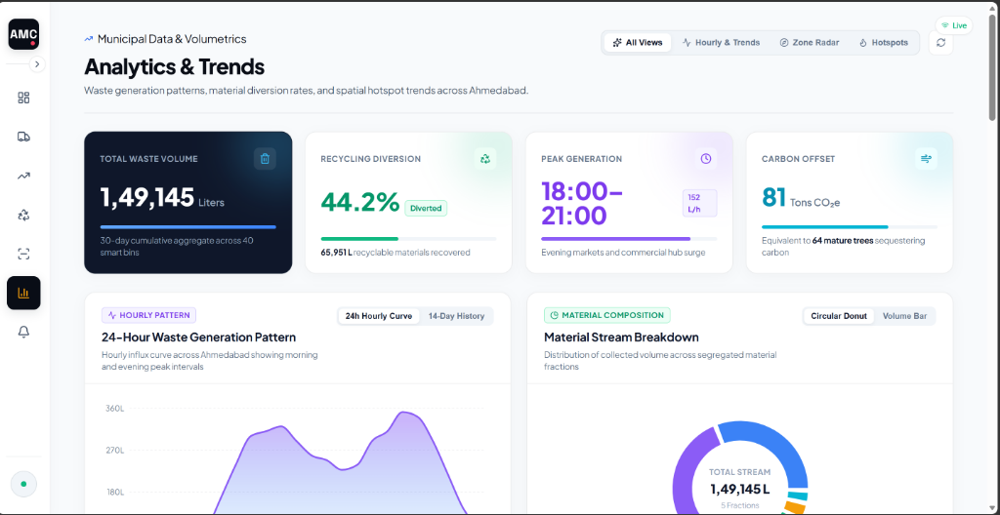 | 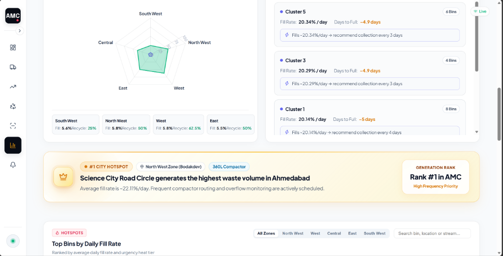 |
| *Municipal volumetrics, 24h diurnal generation curve, material stream donut* | *5-zone radar footprint, spatial cluster velocity, and #1 hotspot banner* |

| Hotspot Leaderboard Table & Environmental Sustainability Impact |
| :---: |
| 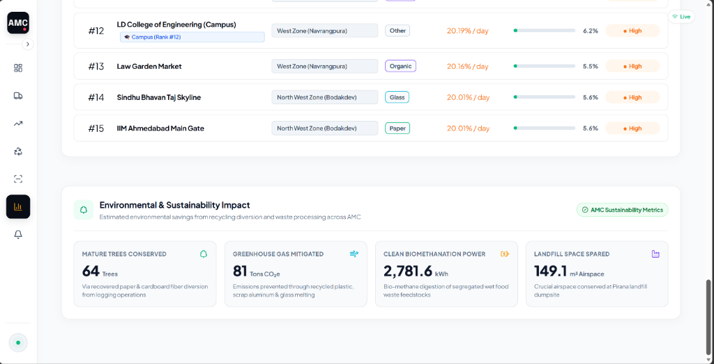 |
| *Dynamic daily fill rate ranking table and quantified circular sustainability metrics (CO₂e, trees, CBG power)* |

</div>


### 4. Predictive AI Overflow Forecasting (Prophet)
* **Time-Series Regression**: Incorporates Meta Prophet and linear autoregression trained on 60 days of hourly sawtooth telemetry.
* **Dynamic Time Horizons**: Interactive time horizon selector (T+1h to T+72h) anticipating overflow risks before bins hit critical thresholds.
* **Proactive CVRP Dispatch**: Preemptive collection route dispatching to avert municipal overflow penalties.

### 5. On-Device Edge PyTorch CNN Waste Classifier
* **Embedded LargeNet Architecture**: Lightweight (1.1 MB) neural network trained to classify waste into 6 primary streams: Plastic, Organic, Paper, Glass, Metal, and Residual.
* **Zero Cloud Latency**: Instantaneous local edge inference with confidence distribution metrics and automated bin sorting guidance.

### 6. Circular AI Recycling Directives & Material Recovery Protocols
* **Autonomous Policy Generation**: Continuous evaluation of segregation ratios, cross-contamination, and fill velocities across all 5 municipal zones to recommend actionable sorting directives.
* **Interactive Zone Sensor Grid**: Modal deep-dive centering Leaflet maps directly onto the target zone's bins, providing live telemetry meters, average fills, and critical overflow counts.
* **Technical Recycling Standards**: 3 specialized circular recovery protocols per material stream (Plastic, Organic, Paper, Metal, and Residuals), mapping streams to certified AMC facilities (Gyaspur MRF, Vastrapur Biomethanation, Pirana WtE).

<div align="center">

| Interactive Zone Sensor Grid & Bins | Technical Recycling Recovery Protocols |
| :---: | :---: |
|  |  |
| *Real-time landmark bin telemetry, zone centroid map, and diversion directives* | *3 certified engineering recycling methods per waste stream with quantified impacts* |

</div>

<br/>

---

## ◈ End-to-End Simulation Engine & Real-Time Telemetry Pipeline

The platform includes a built-in IoT simulation and streaming engine that models the dynamic flow of municipal waste generation across Ahmedabad. It enables operators and evaluators to stress-test collection logistics, observe cascading overflow events, and evaluate real-time re-routing without waiting for real-world hours to elapse.

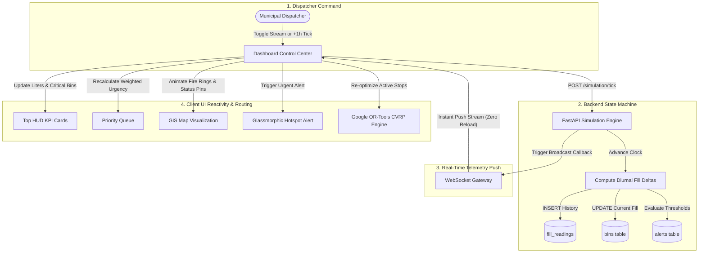

### Complete Execution Path: Step-by-Step

#### 1. Simulation Orchestration & UI Control Center
Positioned front-and-center on the primary [Dashboard](file:///d:/Kavin/programming/Hackathons/BitNBuild/BitnBuild/frontend/src/pages/Dashboard.jsx), the simulation panel provides full real-time command:
* **Stream Live Telemetry (`Toggle`)**: Launches an automated background loop advancing 1 simulated hour every 2.0 seconds. Ideal for watching trucks collect waste and observing how bins replenish during peak commercial hours.
* **`+1h Step` Manual Tick**: Steps the municipal grid forward by exactly one hour, computing new fills and recalculating all dependent KPIs instantly.
* **`Surge All to Critical` (Stress Test Mode)**: Surges all 40 municipal bins across the city to emergency critical capacity (86%–98%) while escalating the municipal #1 waste producer to 100%. The simulation automatically pauses, challenging the CVRP solver to generate emergency multi-vehicle evacuation routes.
* **`Reset to Nominal`**: Restores the municipal grid to baseline safe levels while preserving the continuous generation velocity of the peak hotspot.
* **`Inject Real-World Anomalies`**: Simulates sudden hardware or environmental edge cases:
  * *Night Market Surge*: Rapid volume influx in dense food corridors (e.g. Manek Chowk & Law Garden).
  * *Structural Vandalism / Tip-Over*: IoT accelerometer triggers a tilt alert (`>45°`) requiring safety inspection.
  * *Thermal Hazard*: Internal bin temperature sensor flags fire risk (`>55°C`), dispatching hazard notices.

#### 2. FastAPI Asynchronous State Machine (`/simulation`)
The backend router [backend/app/api/simulation.py](file:///d:/Kavin/programming/Hackathons/BitNBuild/BitnBuild/backend/app/api/simulation.py) executes the orchestration loop:
* **Background Worker**: Managed via an `asyncio.Task` (`_run_sim_loop`) that sleeps for the configured interval, checks safety boundaries, and executes `perform_simulation_step()`.
* **Auto-Pause Safety Interlock**: If all 40 bins reach critical overflow ($>80\%$), the background task automatically terminates itself to prevent runaway infinite database locks, notifying operators via UI status indicators.

#### 3. Mathematical Diurnal Modeling & Persistence
In each simulation step:
* **Diurnal Velocity Computation**: Each bin's fill increments according to realistic municipal consumption rates (nominal bins increment $+5.0\%$ to $+11.0\%$ per tick).
* **Citywide #1 Hotspot Rule**: Ahmedabad's top producer (University Hub Commercial Dumpster, 2,400L) experiences accelerated daily fill increments ($+12.0\%$ to $+18.0\%$), reflecting ground-truth commercial food packaging volume.
* **Database Ledger**:
  * An immutable row is appended to `fill_readings` (`bin_id`, `timestamp`, `fill_percent`) to maintain sawtooth time-series integrity for Prophet ML retraining.
  * The bin's live record in `bins` is updated with the new fill level.
  * System alerts (`Alert`) are generated upon crossing the warning ($>50\%$) or critical ($>80\%$) boundaries.

#### 4. Real-Time WebSocket Broadcasting (`/ws`)
* Rather than requiring client-side polling, the backend dispatches a broadcast callback `_broadcast_callback()`.
* Connected frontend clients receive real-time JSON packets over a persistent WebSocket connection, ensuring instant UI synchronization across multiple dispatch consoles without page reloads.

#### 5. Dynamic Client Reactivity & Automated Routing
Upon receiving a WebSocket broadcast:
* **HUD Matrix**: Real-time counters update immediately (Citywide Collected Liters, Critical Bins, Active Vehicles).
* **Priority Engine**: The client re-ranks bins by multi-factor weighted urgency (Fill %, Time to Overflow, Capacity, Waste Stream).
* **Glassmorphic Hotspot Alert Banner**: If the municipal #1 producer breaches $80\%$, a prominent glassmorphic warning banner animates into view with a 1-click compactor route dispatch action.
* **CVRP Re-Route**: Active collection vehicles dynamically recompute their sequenced stops to clear the most urgent bins first.

<br/>

---

## ◈ GIS Spatial Intelligence: Area Color Sectors & Dynamic Heatmaps

The mapping engine is built with **Leaflet.js** and customized with GPU-accelerated SVG overlays, interactive administrative polygon sectors, and dual-mode spatial intelligence.

### 1. Administrative Area-Wise Color Sectors (`Area Sectors Mode`)
To eliminate visual clutter and provide immediate geographic situational awareness, Ahmedabad is divided into **5 authentic administrative municipal sectors**:

| Zone / Sector | Identifier & Color | Wards Covered | Strategic Sector Character |
| :--- | :---: | :--- | :--- |
| **Central Zone** | <span style="color:#f59e0b">● Amber Gold (`#f59e0b`)</span> | Khadia, Bhadra & Old City Wards | Dense heritage markets, night street food, high organic waste |
| **West Zone** | <span style="color:#3b82f6">● Royal Cobalt (`#3b82f6`)</span> | Navrangpura, Ambawadi & CG Road | Commercial offices, student hubs, plastic & paper dominance |
| **North West Zone** | <span style="color:#8b5cf6">● Royal Violet (`#8b5cf6`)</span> | Bodakdev, SG Highway & Science City | IT parks, shopping malls, high packaging & dry waste |
| **South West Zone** | <span style="color:#06b6d4">● Cyan Teal (`#06b6d4`)</span> | Satellite, Prahlad Nagar & Sarkhej | Corporate corridors, mixed high-rise residential communities |
| **East Zone** | <span style="color:#10b981">● Emerald Green (`#10b981`)</span> | Bapunagar, Nikol & Naroda Wards | Heavy industrial manufacturing, scrap metal & textile residuals |

#### Clean, Non-Cluttered Map Design
* **Text-Free Region Boundaries**: Sector polygons are drawn with crisp dashed borders (`dashArray: '6, 6'`) and soft translucent fill (`fillOpacity: 0.22`), providing clear territorial orientation without obscuring street names or bridges.
* **On-Demand Information Popup**: To avoid screen clutter, region names and metrics only appear when an operator clicks inside a sector polygon. Clicking reveals a glassmorphic card displaying:
  * Zone title, administrative ward coverage, and strategic sector tag.
  * Active bin count and total volumetric capacity.
  * Live average fill percentage and current surge tier.
* **Clutter-Free Bin Indicators**: Standard percentage numbers (`45%`, `78%`) are removed from the map view. Instead, bins are rendered as minimalist color-coded status badges:
  * 🔴 **Critical ($>80\%$)**: `#f43f5e` (Rose Red)
  * 🟡 **Approaching Capacity ($50\%–80\%$)**: `#f59e0b` (Amber Orange)
  * 🟢 **Nominal / Serviced ($<50\%$)**: `#10b981` (Emerald Green)
  * Full numerical telemetry, capacity, waste stream, and battery health appear instantly when clicking any individual bin marker.

---

### 2. Dynamic Waste Generation Heatmap Mode (`Waste Heatmap Mode`)
Operators can switch from territorial sectors to the **Waste Generation Heatmap** via the map HUD toggle:
* **Dynamic Zone Fill Velocity**: In Heatmap mode, the sector polygons dynamically recalculate their fill color based on the live average fill of all contained bins:
  * **Low Density (`<36%` avg fill)**: `#10b981` (Emerald Green)
  * **Moderate Density (`36%–46%` avg fill)**: `#3b82f6` (Cobalt Blue)
  * **High Density (`46%–58%` avg fill)**: `#f97316` (Vibrant Orange)
  * **Critical Surge (`>58%` avg fill)**: `#f43f5e` (Rose Red Alert)
* **Hotspot Pulsating Radar Rings**:
  * Critical bins and Ahmedabad's municipal #1 producer (University Hub Commercial Dumpster) feature multi-layer animated CSS pulsating fire rings (`🔥`).
  * The outer and middle rings pulse continuously, drawing the operator's eye immediately to acute waste accumulation points.

---

### 3. Predictive AI Fill-Level Heatmap (AI Forecast Page)
On the dedicated [AI Forecast Page](file:///d:/Kavin/programming/Hackathons/BitNBuild/BitnBuild/frontend/src/pages/ForecastPage.jsx):
* **Meta Prophet Integration**: Time-series models trained on 60 days of hourly sensor readings extrapolate forward fill levels.
* **Interactive Time Horizon Slider**: Operators adjust the forecast window from `T+1h` up to `T+72h`.
* **Spatial Vulnerability Gradient**: Canvas-based circle markers with graduated radii and color interpolations (Green $\to$ Yellow $\to$ Orange $\to$ Red) expose emergent overflow zones hours before physical accumulation spills onto roadways.

---

### 4. Road-Snapped Multi-Vehicle Route Polylines
* **Strict Bridge Channeling**: The routing engine channels municipal truck traffic strictly across the 6 designated road bridges:
  1. *Subhash Bridge* (North corridor)
  2. *Gandhi Bridge* (Central-north crossing)
  3. *Nehru Bridge* (Central riverfront corridor)
  4. *Ellis Bridge* (Historic central crossing)
  5. *Sardar Bridge* (South-central connection)
  6. *Dr. Ambedkar Bridge* (South industrial corridor)
* **Turn-by-Turn OSRM Geometry**: Polyline routes snap strictly to real Ahmedabad street geometry, color-coded per municipal vehicle, showing sequenced collection stops, turn radii, and realistic driving distances.

<br/>

---

## ◈ Tech Stack & Dependencies

```
Frontend:
  • React 18        — Modern component architecture with hooks & memoization
  • Vite            — Ultra-fast HMR bundler
  • Leaflet.js      — Dynamic interactive GIS mapping with custom overlays
  • Recharts        — Real-time statistical analytics & fill breakdown
  • Lucide Icons    — Clean, modern vector UI iconography

Backend:
  • FastAPI         — High-performance ASGI web framework with OpenAPI docs
  • Python 3.11     — Modern Python runtime
  • SQLAlchemy      — ORM with transaction safety & bulk operations
  • PostgreSQL      — Relational database with PostGIS geospatial indexing

Machine Learning & Optimization:
  • PyTorch         — LargeNet CNN for edge waste classification
  • Prophet         — Time-series forecasting for predictive collection
  • Google OR-Tools — Capacitated Vehicle Routing Problem (CVRP) solver
  • OSRM Engine     — Open Source Routing Machine road geometries
  • scikit-learn    — IsolationForest spatial anomaly detection & K-Means clustering
```

<br/>

---

<div align="center">

Crafted with excellence by **Team ResTart** for **BitNBuild 2026** — Transforming Smart Municipal Governance.

</div>
